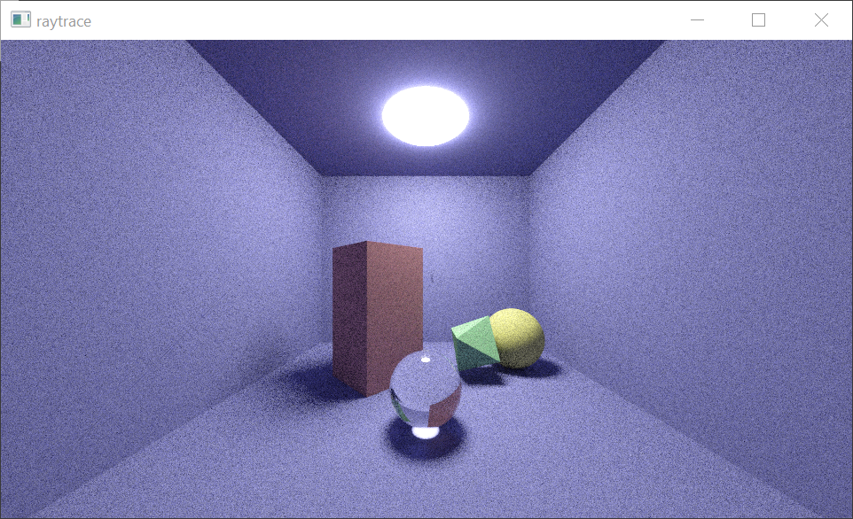

# glsl-pathtracer
Yet another toy raytracer!

This project is a simple path-tracing renderer implemented (mostly) in a single GLSL fragment shader. It started as my venture through [Ray Tracing in One Weekend](https://raytracing.github.io/books/RayTracingInOneWeekend.html) with a GPU accelerated twist, then grew some features over a period of a few weeks.

By default, the program will render its progress on a still frame but animations are supported and rendering frames to image files as a means of offline rendering is also possible.

Scenes are mostly represented as [Signed Distance Fields](https://www.iquilezles.org/www/articles/distfunctions/distfunctions.htm), using an s-expression-based scene description language that is used to generate the shader code that evaluates the SDF. For example, the following scene definition

```
(oUnion
  (oNeg
    (tTrans 0 4 7 
      (mLamb 0.2 0.2 0.5
        (pBox 10 8 15))))
  (tTrans -3 0 0 
    (tRot 0 1 0 0.78 
      (mLamb 0.7 0.3 0.3
        (pBox 2 4 2))))
  (tTrans 3 -2 0 
    (tRot 0 0 1 0.5 
      (tRot 0 1 0 0.78 
        (mLamb 0.3 0.7 0.3
          (pOctahedron 2)))))
  (tTrans 0 -2.5 5 
    (mDiel 1.5
      (pSphere 1.5)))
  (tTrans 6 -2 -1.5 
    (mLamb 0.8 0.8 0.2
      (pSphere 2)))
  (mEmit 1 1 1 100
    (tTrans 0 15 0 
      (pSphere 4))))
```

generates this scene



The documentation for this scene definition language is literally the code that parses it. 

## Building this yourself

This is a toy, so very little support goes into environments different than my own. This repo is messy enough to contain VS2019 solution/project files, so maybe trying that is a good start. In a nutshell though, anything that can compile the 3 C++ files and link to GLEW and SFML should be good to go.
